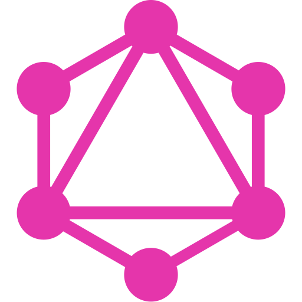

  

 

# Что будем делать (29 июля 2020)
1) Продолжим верстать "Super Host"

# Что сделали сегодня
1) Продолжили верстать "Super Host" (продолжили секцию 'intro')

# Ключевые моменты урока
1) На любой тег можно установить фоновую картинку через  css
2) Для установки картинки как фона прописываем 
<pre>
  background-image: url(-тут путь относительный путь к файлу картинки-);
</pre>
3) Катинка может заполнять весь экран повторением, остобенно когда эта картинка маленькая. Что-бы этого не было пишем:
<pre>
  background-repeat: no-repeat;
</pre>
4) Для того чтобы картинка покрыла все свободное пространство и стала резиновой при изменеии размера экрана, то пишем:
<pre>
  background-size: cover;
</pre>
5) Что бы центр картинки был всегда посередине экрана, то пишем:
<pre>
  background-position: center;
</pre>
6) Учтановка фона на элемент очень частая операция, поэтому заходи сюда и просто копируй все свойства меняя при этом относительный путь к файлу картинки
<pre>
  .some {
    background-image: url(../images/background.jpg);
    background-repeat: no-repeat;
    background-size: cover;
    background-position: center;
    height: 830px;
}
</pre>
7) Пути к файлам бывают относительные или абсолютные. Абсолютный путь к файлу это полный путь от корня файловой системы, например
<pre>
  /home/exh/nginx/domains/img/
</pre>
такие пути неудобны в использовании и их стоит избегать. Вместо этого часто используются относительные пути. Относительный путь это путь к файлу относительно того места откуда мы этот файл ищем, например, нам нужно получить доступ к файлу background.jpg и использовать его в текущем файле, но файл лежит по иерархии выше в папке images:
<pre>
  ../images/background.jpg
</pre>
Приведу очень хорошую аналогию которая поможет лучше понять. Допустим, мне нужно попасть в компьютерный магазин "SoftCom", который находится на улице Садовой в городе Николаев. Есть два способа указать адрес: 
 
<strong>Способ первый:</strong> (абсолютный) -> вселенная/галактика млечного пути/солнечная система/планета земля/страна Украина/город Николаев/улица соборная/магазин "SoftCom" 
<strong>Способ второй:</strong> (относительный(относительно меня)) -> улица Садовой/магазин "SoftCom"

# Разное
Новая версия "SuperHost"  уже залита

 
 
 

  
  
  
  
  
  
  
  
  

